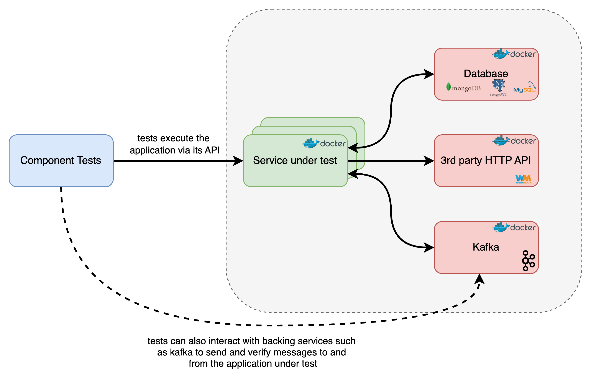
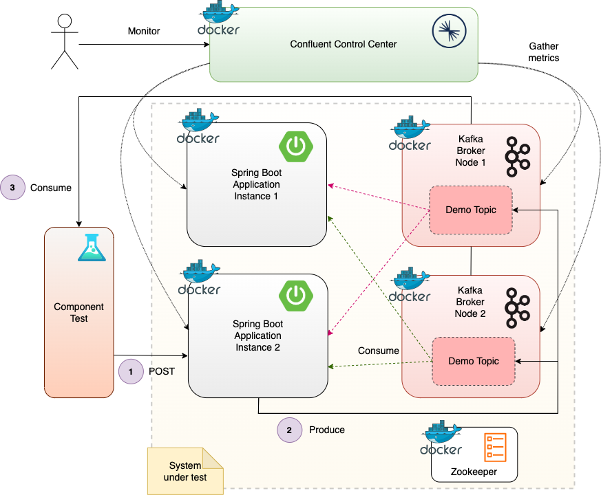
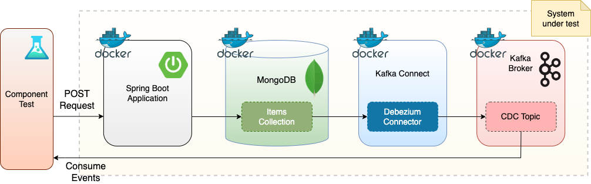
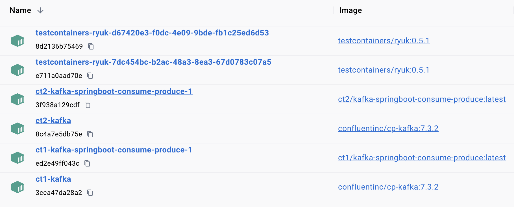
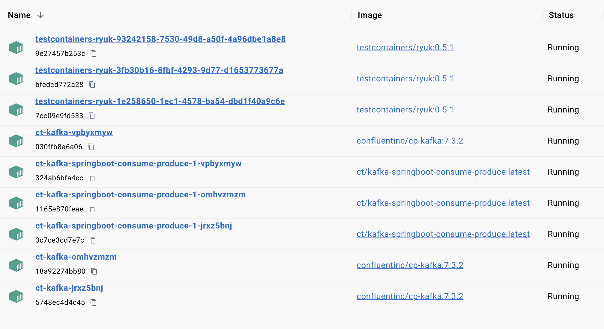
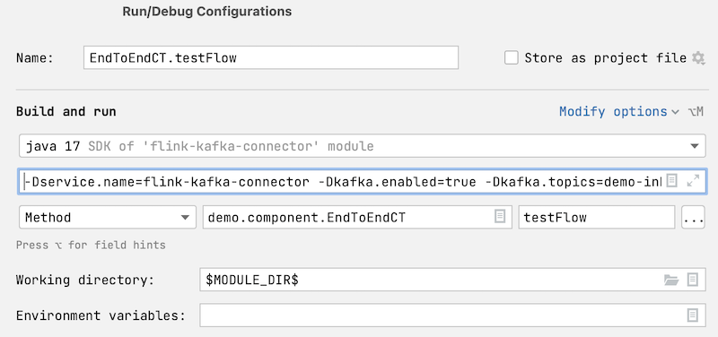

# Component Test Framework

# Introduction
The **Lydtech Component Test Framework** enables developers to write out-of-process component tests—a powerful form of testing where your microservice runs in its own Docker container, just like in production, and is tested as a black box.

Using the [Testcontainers](https://testcontainers.com/) library, the framework spins up the service under test along with all of its dependent services—databases, message brokers, caches, even cloud services like S3 via LocalStack—in isolated Docker containers.



This approach provides high-fidelity testing, meaning it closely replicates real-world conditions while still being fast, local, and developer-friendly. It gives you another valuable tool in your testing toolbox—providing a level of confidence that’s often missing between unit tests and full end-to-end tests.

Tests can be run locally by developers during development or automatically in your CI pipeline, providing fast feedback wherever you need it.

Just annotate your JUnit test, and the framework handles everything—startup, wiring, and cleanup.

# Quick Start
Follow these steps to add your first Component Test to a minimal Spring Boot App.

1. visit https://start.spring.io
2. Choose Maven, accept the defaults for other fields, choose a project name & add the following dependencies
   - `Spring Web` - this project will have a simple Rest Controller
   - `Spring Boot Actuator` - the application health endpoint is a helpful way to know the service has started
3. Generate the project and open in your favourite IDE
4. Add a simple REST controller `MyController.java` that responds with a fixed string:
```java
@RestController
public class MyController {
    @GetMapping("/api/v1/hello")
    public String sayHello(){
        return "Hello there";
    }
}
```
5. Add a simple Dockerfile to allow your app to be packaged into a Docker image
```
FROM openjdk:17-jdk-slim
COPY target/*.jar app.jar
EXPOSE 8080
ENTRYPOINT ["sh", "-c", "java $JAVA_OPTS -jar app.jar"]
```
6. Now its time for the Lydtech Component Test Framework. add the following test dependencies to your pom.xml. The first pulls in CTF, the second pulls in RestAssured - a handy tool for testing HTTP services.
```xml
<dependency>
   <groupId>dev.lydtech</groupId>
   <artifactId>component-test-framework</artifactId>
   <version>3.9.3</version>
   <scope>test</scope>
</dependency>
<dependency>
   <groupId>io.rest-assured</groupId>
   <artifactId>rest-assured</artifactId>
   <scope>test</scope>
</dependency>
```
7. With the dependency added, Lets add some config to initiate the Component tests. 
   1. In the `properties` block of your pom, add `<containers.stayup>false</containers.stayup>` 
   2. This config introduces a minimal `component` profile to run all tests named with the pattern *CT.java.
```xml

<profiles>
        <profile>
            <id>component</id>
            <build>
                <plugins>
                    <plugin>
                        <groupId>org.apache.maven.plugins</groupId>
                        <artifactId>maven-surefire-plugin</artifactId>
                        <configuration>
                            <includes>
                                <include>*CT.*</include>
                            </includes>
                            <environmentVariables>
                                <TESTCONTAINERS_REUSE_ENABLE>${containers.stayup}</TESTCONTAINERS_REUSE_ENABLE>
                            </environmentVariables>
                        </configuration>
                    </plugin>
                </plugins>
            </build>
        </profile>
</profiles>
```
8. Add a configuration file for the component tests in src/test/resources/component-test.yml. This is a minimal file that tells CTF to:
   - bind a docker container port to port 8080 which is what the application listens on
   - use the following Docker image name for the service container: `samples/my-maven-app`
```yaml
service:
   port: 8080
   name: my-maven-app
container:
   name:
      prefix: samples
```
9. Finally, lets add our Component test. Note the `@ExtendWith` annotation to enable the Lydtech Component Test Framework. Also notice how it retrieves the pre-configured `RestAssured` instance which is configured to hit the service that the framework initiated. The test issues a `GET api/v1/hello` and asserts that the response code is 200 with the correct body.
```java
@ExtendWith(ComponentTestExtension.class)
public class MyComponentTestCT {
    @Test
    public void test() {
        RestAssured.baseURI = ServiceClient.getInstance().getBaseUrl();
        RestAssured.get("api/v1/hello").then().assertThat()
                .statusCode(200)
                .body(equalTo("Hello there"));
    }
}
```
10. Now lets build the service: Run `./mvnw clean install; docker build -t samples/my-maven-app .` 
11. Now run the Component Tests using `./mvnw clean install -Pcomponent` and see the test run and pass. Thats it, you've added your first component test against your simple service! Now check out some of the examples below for more complex examples - where the real value of the framework lies.

See the following repo for this code
https://github.com/lydtechconsulting/simple-component-test

# Contents

- [Advanced Example 1](README.md#advanced-example-1)
- [Advanced Example 2](README.md#advanced-example-2)
- [Supported Resources](README.md#supported-resources)
- [Supported Versions](README.md#supported-versions)
- [Configuration Properties](README.md#configuration-properties)
  - [Method 1: Properties via specific properties/yml file](README.md#method-1-properties-via-specific-properties--yml-file)
  - [Method 2: Properties via command line environment variables](README.md#method-2-properties-via-command-line-environment-variables)
  - [Method 3: Properties via environment variables in Maven/Gradle config](README.md#method-3-properties-via-environment-variables-in-maven--gradle-config)
- [Core Properties](README.md#core-properties)
- [Sample Projects](README.md#sample-projects)
- [Using Maven](README.md#using-maven)
- [Using Gradle](README.md#using-gradle)
- [Tips and Tricks](README.md#tips-and-tricks)
  - [Keeping Docker Containers up between test runs](README.md#keeping-docker-containers-up-between-test-runs)
  - [Setting the service under test's application properties](README.md#setting-the-service-under-tests-application-properties)
  - [Configuring when the service under test has started successfully](README.md#configuring-when-the-service-under-test-has-started-successfully)
  - [Running the component tests](README.md#running-the-component-tests)
  - [passing extra args](README.md#passing-extra-args)
  - [discovering the service URL](README.md#discovering-the-service-url)
  - [Running The Component Tests](README.md#running-the-component-tests)
  - [Running The Component Tests within the IDE](README.md#running-component-tests-within-the-ide)
  - [Running Concurrent Test Runs](README.md#running-concurrent-component-test-runs)
  - [Remote debugging the service](README.md#remote-debugging-the-service)
  - [Handy Docker Commands](README.md#handy-docker-commands)
  - [Additional Containers](README.md#additional-containers)
- [Supported Technologies / Backing Services](README.md#supported-technologiesbacking-services)
- [Troubleshooting](README.md#troubleshooting)
  - [Docker Communication Error](README.md#docker-communication-error) 
  - [Services failing to start](README.md#services-failing-to-start) 
  - [Dependency conflicts](README.md#dependency-conflicts) 

# Advanced example 1
In the following example, the Component Test Framework spins up the system under test.  In this case it comprises of two instances of the Spring Boot application to test and a two node Kafka cluster with Zookeeper, each in their own Docker container.  The application has a REST endpoint and consumes messages from, and produces messages to, Kafka.  Confluent Control Center is also spun up in a Docker container, which monitors the application instances and Kafka broker nodes, allowing the tester to view metrics on the system under test.  This can be a helpful tool in debugging test issues.



_Figure 1: Component testing a Spring Boot application that integrates with Kafka_

This test is available in the repository [here](https://github.com/lydtechconsulting/kafka-springboot-consume-produce).

# Advanced example 2
In this second example, a Change Data Capture (CDC) flow is tested.  The component test spins up the Spring Boot application, MongoDB, Debezium (Kafka Connect), and Kafka in Docker containers using the Component Test Framework.  The test registers the Debezium connector with Kafka Connect, and the end to end CDC flow is tested.



_Figure 2: Component testing a CDC flow with Kafka Connect_

This test is available in the repository [here](https://github.com/lydtechconsulting/kafka-connect-debezium-mongodb).

[[Back To Top](README.md#component-test-framework)]

# Supported Resources:
The current list of supported resources / features / backing services is currently as follows. New features are continuously being added. Please keep an eye out here for more additions
- Configurable number of instances of the service under test.
- Additional containers (simulators/services)
- Kafka broker (standard or native build)
- Kafka Schema Registry
- Postgres database
- MongoDB database
- MariaDB database
- Debezium Kafka Connect
- Standalone wiremock
- Localstack (AWS components - e.g. DynamoDB)
- Confluent Control Center
- Conduktor Platform
- Conduktor Gateway
- Elasticsearch
- Ambar (Event sourcing)

[[Back To Top](README.md#component-test-framework)]

# Supported Versions
The current version of `component-test-framework` version `2.x` supports:
- Spring Boot 3.x
- Kafka Clients 3.x
- Java 17

[[Back To Top](README.md#component-test-framework)]

# Configuration Properties
The **Component Test Framework** supports many features that can be enabled and configured via an array of configuration properties. 

The framework supports a number of methods for setting these properties. The recommended approach is [Method 1: specific properties / yml file](README.md#method-1-properties-via-specific-properties--yml-file)

### Method 1: Properties via specific properties / yml file
Declare the properties that should be overridden from their defaults in a file named `component-test.properties`, `component-test.yaml`, or `component-test.yml`.  This file needs to be in the test classpath, so place in the `src/test/resources` folder to ensure it is built into the classpath directory.

Add as key/value pairs or in yaml format accordingly.  e.g. in the properties file:
```
service.name=demo
service.port=9001
kafka.enabled=true
```
Or in the yaml/yml file:
```
service:
    name: demo
    port: 9001
kafka:
    enabled: true
```

The file can be given a custom name by setting the system property `component.test.configuration.filename`.  e.g. `-Dcomponent.test.configuration.filename=test-config.properties`.

### Method 2: Properties via command line environment variables
If a properties file has not been provided, then the properties can be overidden using system properties.  These can be provided on the command line, e.g.
```
mvn test -Pcomponent -Dservice.name=demo -Dservice.port=9001 -Dkafka.enabled=true
```

### Method 3: Properties via environment variables in Maven / Gradle config
Inside the maven `pom.xml` in the `maven-surefire-plugin`.  e.g.
```
<systemPropertyVariables>
    <service.name>${project.name}</service.name>
    <service.port>9001</service.port>
    <kafka.enabled>true</kafka.enabled>
</systemPropertyVariables>
```
Or via gradle in the `gradle.properties`.

### Notes on fundamental properties
Note that the following 2 properties can not be set in the test properties/yml files. 
- `containers.stayup`
- `component.test.configuration.filename`

# Core properties
The table shows the core configuration properties, with technology specific properties available in the sub documents mentioned in [Supported Technologies / Backing services](README.md#supported-technologiesbacking-services).
| Property                                        | Usage                                                                                                                                                                                                                                                                                                                                                                           | Default                            |
|-------------------------------------------------|---------------------------------------------------------------------------------------------------------------------------------------------------------------------------------------------------------------------------------------------------------------------------------------------------------------------------------------------------------------------------------|------------------------------------|
| component.test.configuration.filename           | The name of the file for the Testcontainers configuration overrides.  Can only be set as a system property.  If not set, will look for `component-test.properties`, `component-test.yaml` or `component-test-yml` in the test runtime classpath.  If none of these files is present, then will use any system property overrides that are set.                                  |                                    |
| containers.stayup                               | Whether the Docker containers should remain up after a test run.  This should be used to set the environment variable `TESTCONTAINERS_REUSE_ENABLE`.  Cannot be set to `true` if `container.append.group.id` is also `true`.  This can only be set as a system property, it cannot be overridden in the component test properties file.                                         | `false`                            |
| container.name.prefix                           | The Docker container prefix name to use.  A namespace for the component test containers.  Using different prefixes means that multiple component test runs can run concurrently without conflict.                                                                                                                                                                               | `ct`                               |
| container.main.label                            | The Docker containers housing the service instances has this label applied.  This is used as part of the `containers.stayup` check, along with the `container.name.prefix`, to determine if the containers are already running.  It is recommended to leave this as the default value, so that subsequent test runs from an IDE do not need to set a system parameter override. | `main-container`                   | 
| container.append.group.id                       | Whether to enable grouping the set of containers in the component test via a unique identifier that is appended to the container name.  This helps identify the group of containers in the given test run.  If set to `true` it means that multiple component test runs can run concurrently without conflict, but cannot be used if `containers.stayup` is set to `true`.      | `false`                            |
| service.name                                    | The name of the service, used in the service Docker container name.                                                                                                                                                                                                                                                                                                             | `app`                              |
| service.instance.count                          | The number of instances of the service under test to start.                                                                                                                                                                                                                                                                                                                     | `1`                                |
| service.image.tag                               | The tagged image of the service Docker container to use.                                                                                                                                                                                                                                                                                                                        | `latest`                           |
| service.port                                    | The service port number.                                                                                                                                                                                                                                                                                                                                                        | `8080`                             |
| service.debug.port                              | The port for remote debugging the service.                                                                                                                                                                                                                                                                                                                                      | `5001`                             |
| service.debug.suspend                           | Use `suspend=y` for remote debugging params. Useful for diagnosing service startup issues.                                                                                                                                                                                                                                                                                      | `false`                            |
| service.envvars                                 | A comma-separated list of key=value pairs to pass as environment variables for the service container, e.g. `ARG1=value1,ARG2=value2`.                                                                                                                                                                                                                                           |                                    |
| service.additional.filesystem.binds             | A comma-separated list of key=value pairs to use as additional filesystem binds for the service container, where `key=sourcePath` and `value=containerPath` e.g. `./src/test/resources/myDirectory=./myDirectory`.                                                                                                                                                              |                                    |
| service.config.files.system.property            | The name of the system property that denotes the location of additional properties files (as specified in `service.application.yml.path`) for the application.                                                                                                                                                                                                                  | `spring.config.additional-location` |
| service.application.yml.path                    | Path to the application config file for property overrides (yml format for the service under test).                                                                                                                                                                                                                                                                             | `src/test/resources/application-component-test.yml` |
| service.application.args                        | Application args to pass to the service under test.  Expects the `Dockerfile` to include `APP_ARGS` as part of the `ENTRYPOINT`. e.g. `ENTRYPOINT ["sh", "-c", "java ${JAVA_OPTS} -jar /app.jar ${APP_ARGS}"]`                                                                                                                                                                  |                                    |
| service.startup.health.endpoint                 | The log health endpoint to wait for on startup.  Defaults to the Spring Actuator health endpoint.  If `service.startup.log.message` is set then this setting is ignored.                                                                                                                                                                                                        | `/actuator/health`                 |
| service.startup.log.message                     | The log message to wait for on startup. If set, instead of waiting for the health endpoint to return healthy, the container is not considered started until this regex is present in its logs.  e.g. `.*Startup completed.*`                                                                                                                                                    |                                    |
| service.startup.timeout.seconds                 | The number of seconds to wait for the service to start before considered failed.                                                                                                                                                                                                                                                                                                | `180`                              |
| service.container.logging.enabled               | Whether to output the service Docker logs to the console.                                                                                                                                                                                                                                                                                                                       | `false`                            |
| additional.containers                           | Colon separated list of additional containers to spin up, such as simulators.  Each additional container entry requires a comma separated list of details:  name, port, debugPort, imageTag, containerLoggingEnabled.  Example is: `third-party-simulator,9002,5002,latest,false:external-service-simulator,9003,5003,latest,false`                                             |                                    |

The configuration is logged at test execution time at INFO level.  Enable in `logback-test.xml` with:
```
<logger name="dev.lydtech" level="INFO"/>
```

[[Back To Top](README.md#component-test-framework)]

# Sample Projects

Example companion projects have been created to demonstrate usage of this framework.

This project https://github.com/lydtechconsulting/ctf-example-service demonstrates using:
- Kafka
- Postgres
- Debezium
- Wiremock

This project https://github.com/lydtechconsulting/ctf-example-multi-module demonstrates using:
- A child `component-test` module.
- REST calls to the service under test.
- Multiple additional containers (simulators) - these also benefit from the multi module structure as each is defined in its own child module.
- Running component tests with gradle.

Other reference projects that utilise the framework for component testing the application:

https://github.com/lydtechconsulting/kafka-idempotent-consumer-dynamodb - includes Localstack with DynamoDB and uses multiple instances of the service under test.

https://github.com/lydtechconsulting/kafka-schema-registry-avro - a multi-module maven project demonstrating using the Confluent Schema Registry, and demonstrates using Confluent Control Center and Conduktor Platform with Confluent Schema Registry integration.

https://github.com/lydtechconsulting/kafka-metrics - demonstrates using multiple Kafka broker nodes, multiple instances of the service under test, topic replication and min-insync replicas, with Confluent Control Center and Conduktor Platform).

https://github.com/lydtechconsulting/kafka-springboot-consume-produce - demonstrates using Kafka (either standard or native build) to consume and produce events, and observe events using Confluent Control Center and Conduktor.

https://github.com/lydtechconsulting/kafka-streams - demonstrates using Kafka with the Kafka Streams API.

https://github.com/lydtechconsulting/kafka-idempotent-consumer - uses multiple instances of the service under test.

https://github.com/lydtechconsulting/kafka-consumer-retry - uses multiple instances of the service under test.

https://github.com/lydtechconsulting/kafka-batch-consume - uses a custom Producer with additional configuration for batch send.

https://github.com/lydtechconsulting/kafka-chaos-testing - demonstrates using Conduktor Gateway for chaos testing the service under test.

https://github.com/lydtechconsulting/kafka-connect-debezium-postgres - demonstrates using Kafka Connect with Debezium for Change Data Capture with Postgres.

https://github.com/lydtechconsulting/kafka-connect-debezium-mongodb - demonstrates using Kafka Connect with Debezium for Change Data Capture with MongoDB.

https://github.com/lydtechconsulting/springboot-rest - demonstrates hitting the service via a REST API to perform CRUD operations.

https://github.com/lydtechconsulting/springboot-postgres - demonstrates using Postgres as the database for reading and writing items.

https://github.com/lydtechconsulting/springboot-mongodb - demonstrates using MongoDB as the database for reading and writing items.

https://github.com/lydtechconsulting/springboot-elasticsearch - demonstrates reading and writing items to Elasticsearch.

https://github.com/lydtechconsulting/kafka-sasl-plain - demonstrates consumers and producers connecting to Kafka using the Simple Authentication and Security Layer (SASL) PLAIN protocol.

https://github.com/lydtechconsulting/micronaut-postgres-java - demonstrates a Micronaut application written in Java, built with Gradle, using Postgres as the database for reading and writing items.

https://github.com/lydtechconsulting/micronaut-postgres-kotlin - demonstrates a Micronaut application written in Kotlin, built with Gradle, using Postgres as the database for reading and writing items.

https://github.com/lydtechconsulting/micronaut-kafka-java - demonstrates a Micronaut application written in Java, built with Gradle, using Kafka as the messaging broker for sending and receiving items.

https://github.com/lydtechconsulting/micronaut-kafka-kotlin - demonstrates a Micronaut application written in Kotlin, built with Gradle, using Kafka as the messaging broker for sending and receiving items.

https://github.com/lydtechconsulting/flink-kafka-connector - demonstrates a Flink application using Kafka as the source and sink for streaming data.

https://github.com/lydtechconsulting/ambar-event-sourcing - demonstrates event sourcing with Ambar.

[[Back To Top](README.md#component-test-framework)]

# Using Maven

The [Quick Start](README.md#quick-start) section above demonstrates how simple it is to use CTF with Maven. There are plenty of Examples in [[Sample projects](README.md#sample-projects)] that use Maven.

One important decision to make is whether to 
1. include the component test classes alongside other unit / component tests and use a Maven profile to run them. Example project: https://github.com/lydtechconsulting/ctf-example-service 
2. Use a Maven multi module approach where the Component Test classes live in their own module. Example project: https://github.com/lydtechconsulting/ctf-example-multi-module

There is an advantage in separating its usage from the service under test to ensure that it does not utilise any of the service's classes, and to ensure there are no dependency clashes with the serivce's dependencies. A multi module approach could also be seen as cleaner and provides good separation of concerns but for basic projects, introducing multi modules is probably overkill.


[[Back To Top](README.md#component-test-framework)]

# Using Gradle
Here is a Quick Start with Gradle guide in line with [[The Maven Quick Start ](README.md#quick-start)]

1. visit https://start.spring.io
2. Choose `Gradle - Groovy`, accept the defaults for other fields, choose a project name & add the following dependencies
    - `Spring Web` - this project will have a simple Rest Controller
    - `Spring Boot Actuator` - the application health endpoint is a helpful way to know the service has started
3. Generate the project and open in your favourite IDE
4. Add a simple REST controller `MyController.java` that responds with a fixed string:
```java
@RestController
public class MyController {
    @GetMapping("/api/v1/hello")
    public String sayHello(){
        return "Hello there";
    }
}
```
5. Add a simple Dockerfile to allow your app to be packaged into a Docker image
```
FROM openjdk:17-jdk-slim
COPY build/libs/*.jar app.jar
EXPOSE 8080
ENTRYPOINT ["sh", "-c", "java $JAVA_OPTS -jar app.jar"]
```
6. Now its time for the Lydtech Component Test Framework. add the following dependencies block of your build.gradle. The first pulls in CTF, the second pulls in RestAssured - a handy tool for testing HTTP services.
```
	testImplementation 'dev.lydtech:component-test-framework:3.9.3'
    testImplementation 'io.rest-assured:rest-assured'
```
7. With the dependency added, Lets add some Gradle config to 
    1. exclude component tests (with the suffix `TestCT.class`) from the main test task
    2. add a `componentTest` task to run only the component tests (with the suffix *CT.java).
```
tasks.named('test') {
	useJUnitPlatform()
	exclude '**/*TestCT.class'
}

tasks.register('componentTest', Test) {
	useJUnitPlatform()
	description = 'Runs only Component Tests'
	group = 'verification'
	systemProperties = System.properties
	environment "TESTCONTAINERS_REUSE_ENABLE", System.getProperty('containers.stayup')

	include '**/*TestCT.class'
}
```
8. Add a configuration file for the component tests in src/test/resources/component-test.yml. This is a minimal file that tells CTF to:
    - bind a docker container port to port 8080 which is what the application listens on
    - use the following Docker image name for the service container: `samples/my-maven-app`
```yaml
service:
   port: 8080
   name: my-maven-app
container:
   name:
      prefix: samples
```
9. Finally, lets add our Component test. Note the `@ExtendWith` annotation to enable the Lydtech Component Test Framework. Also notice how it retrieves the pre-configured `RestAssured` instance which is configured to hit the service that the framework initiated. The test issues a `GET api/v1/hello` and asserts that the response code is 200 with the correct body.
```java
@ExtendWith(ComponentTestExtension.class)
public class MyComponentTestCT {
    @Test
    public void test() {
        RestAssured.baseURI = ServiceClient.getInstance().getBaseUrl();
        RestAssured.get("api/v1/hello").then().assertThat()
                .statusCode(200)
                .body(equalTo("Hello there"));
    }
}
```
10. Now lets build the service: Run ` ./gradlew clean build; docker build -t samples/my-maven-app .`
11. Now run the Component Tests using `./gradlew clean componentTest` and see the test run and pass. Thats it, you've added a component test in a Gradle project! 
Note: You won't see the test output by default using Gradle. To see StdOut include `--info` on the end of the Gradle command. Additionally, the test output is available in the Junit report found under `build/reports/tests`

See the following repo for this code
https://github.com/lydtechconsulting/simple-component-test

[[Back To Top](README.md#component-test-framework)]

# Tips and Tricks
This section should help you get the most out of CTF

## Keeping Docker Containers Up Between Test Runs

A common usage of this framework is to keep the Docker containers running whilst developing and running the component tests.

As it can take some time to spin up multiple Docker containers for the different resources in use, skipping this step for each test run is a key advantage.

To achieve this, use the `containers.stayup` configuration property:
```
mvn test -Pcomponent -Dcontainers.stayup
```
or for Gradle
```
./gradlew clean componentTest -Dcontainers.stayup=true
```

This property can not be set in the component test properties file, it must be set as a system property as it is used in the `maven-surefire-plugin` in the `pom.xml` when using maven, or in the `build.gradle` when using gradle.

With the containers running the component tests can for example be run from with the IDE (through the standard right-click Run/Debug test).

Changes to system properties are only respected when containers are being brought up.  So if changes are required then the containers must be stopped and restarted.

To manually stop the containers, see the Docker commands section below.

The `containers.stayup` property drives the `TESTCONTAINERS_REUSE_ENABLE` environment property.  This is a Testcontainers library property it uses to determine whether it should automatically clean up the Docker containers at the end of the test run.

## Setting the service under test's Application Properties

By default the library expects an `application-component-test.yml` properties file in the `src/test/resources` directory for the service under test with the necessary property overrides.  e.g. to specify the Kafka bootstrap-services URL:
```
---
kafka:
    bootstrap-servers: kafka:9092
```

This default location can be overridden using the property `service.application.yml.path`.

By default, the system property used to specify the location of the additional properties file is the Spring Boot `spring.config.additional-location`.  This system property name can be overridden via `service.config.files.system.property`.  For example, for a Micronaut application, this should typically be set to `micronaut.config.files`.


## Configuring when the service under test has started successfully

The service under test can expose its health endpoint for the test set up to know that the service has successfully started before the configurable `service.startup.timeout.seconds` has expired.  The endpoint to check can be overridden via the `service.startup.health.endpoint`.  It defaults to the Spring Actuator health endpoint:
```
/actuator/health
```
Include the Spring Boot Actuator module (along with the Spring Boot Starter Web module) in the service pom for this to auto-enable:
```
<dependency>
    <groupId>org.springframework.boot</groupId>
    <artifactId>spring-boot-starter-web</artifactId>
    <version>${spring.boot.version}</version>
</dependency>
<dependency>
    <groupId>org.springframework.boot</groupId>
    <artifactId>spring-boot-starter-actuator</artifactId>
    <version>${spring.boot.version}</version>
</dependency>
```
For the default Micronaut health endpoint configure this to `/health`.  Ensure the application has the following dependency:

```
<dependency>
    <groupId>io.micronaut</groupId>
    <artifactId>micronaut-management</artifactId>
    <version>{micronaut-version}</version>
</dependency>
```

Alternatively the presence of a startup log message can be used to determine whether the service has successfully started, using the `service.startup.log.message` configuration.  Set this to the regex String to match on.  For example, set this property to `.*Startup completed.*` to match the following log message from a Micronaut application:
```
2024-02-27 14:05:46 INFO  i.m.r.Micronaut - Startup completed in 31ms. Server Running: http://d911af15be07:8080
```

If this property is set it will be used instead of the startup health endpoint property.

## Passing Extra Args

To pass extra args to the service under test, update the `Dockerfile` entry point to include `$APP_ARGS` before Dockerising the service:
```
ENTRYPOINT ["sh", "-c", "java ${JAVA_OPTS} -jar /app.jar ${APP_ARGS}"]
```

Set the `service.application.args` with the extra arguments required.  e.g. `-Dservice.application.args=kafka:9092`.

These will then be passed to the main application class, e.g.
```
public static void main(String[] args) {
    if (args.length > 0) {
        String bootstrapServers = args[0];
```

## Discovering The Service URL

The `dev.lydtech.component.framework.client.service.ServiceClient` provides a static `getBaseUrl` method to get the base URL of the service under test, enabling REST calls to be made to it.
e.g. if using RestAssured as the HTTP client in the test:
```
RestAssured.baseURI = ServiceClient.getInstance().getBaseUrl();
```

Querying using RestAssured:
```
RestAssured.get("/v1/my-service").then().assertThat().statusCode(202)
```

## Running The Component Tests

### Maven

Run tests:
```
mvn test -Pcomponent
```

Read about [[Keeping the Docker containers up between test runs](README.md#keeping-docker-containers-up-between-test-runs)]

Override any of the other configurable properties in the same way, specifying `-D` args.  e.g.
```
mvn test -Pcomponent -Dservice.instance.count=2 -Dkafka.enabled
```

### Gradle

Run tests:
```
./gradlew componentTest
```

Read about [[Keeping the Docker containers up between test runs](README.md#keeping-docker-containers-up-between-test-runs)]

Override any of the other configurable properties in the same way, specifying `-D` args.  e.g.
```
./gradlew clean build -Dservice.instance.count=2 -Dkafka.enabled
```


## Running Concurrent Component Test Runs

In may be required to run multiple component tests concurrently in the same environment.  This may happen in the CI pipeline for example, where perhaps the `main` branch is being built and tested at the same time as one or more `PR` branches.  To facilitate this, there are two alternative approaches that can be adopted.

### Container Name Prefix

Set the `container.name.prefix` to a unique value for the test run.  For example, two concurrent test runs could be executed by building the two containers, and running the component tests with the different prefixes:
```
docker build -t ct1/kafka-springboot-consume-produce:latest .
docker build -t ct2/kafka-springboot-consume-produce:latest .

mvn test -Pcomponent -Dcontainer.name.prefix=ct1
mvn test -Pcomponent -Dcontainer.name.prefix=ct2
```

The following screenshot shows two component test runs executing simultaneously, with prefixes `ct1` and `ct2`. Each group of containers is managed by a `testcontainers-ryuk` container.



_Figure 3: Concurrent component test runs using container.name.prefix_

This has the advantage that one or both groups of containers could be left up between test runs and reused on a subsequent test execution, using the `containers.stayup` property.

### Container Append Group Id

Set the `container.append.group.id` property to `true`.  This appends an eight character unique Id to the names of all the containers spun up in the component test run.  This means that when another test run is started the container names do not conflict, and this subsequent test run can execute concurrently with the first.

Note that either the `containers.stayup` property or the `container.append.group.id` property can be set to `true` but not both.  This is because the configuration is allowing either the existing containers that are left up between test runs to be reused for the next test run, or for multiple groups of containers to be run concurrently.

The following screenshot shows three component test runs executing simultaneously.  Each group of containers is managed by a `testcontainers-ryuk` container.



_Figure 4: Concurrent component test runs using container.append.group.id_

## Running Component Tests Within The IDE

Component tests can be run within the IDE as other tests are.  Typically a component test run is executed via the `mvn` command, and must be configured to leave the containers up.  This means that the configuration properties defined in the pom are used.

Tests can then be re-run via the usual IDE mechanism.  However for the framework to detect that the containers are up it must be passed the configured service name.

Therefore when using the Run/Debug test dialog in the IDE, include at least the `service.name` system parameter.  e.g.
```
-Dservice.name=ctf-example-service
```
If any other settings are required these should also be declared (if the containers have not already been left up from a previous run).  For example, enabling Kafka and configuring the topics in the Intellij dialog:



_Figure 5: Configuring parameters in the run / debug dialog_

If the default service name (`app`) is used then this step can be skipped.

In order to run component tests from the IDE in the first place that will trigger the required Docker containers being started up then the Configuration dialog must be populated with the required System Properties in order to override the defaults.

e.g. add the following to the Configuration dialog to start up Postgres and Kafka:
```
-postgres.enabled=true -Dkafka.enabled=true
```

## Remote Debugging The Service

As the service is running in a Docker container, in order to debug a test run then remote debugging is required.

When configuring the service under test, a value for the `service.debug.port` property must be supplied.  This port is mapped to a random port when the Docker container is started (or multiple in the case where multiple instances of the service are configured to run).

Execute a test run, leaving the containers up, with `containers.stayup`.  Now remote debugging can be undertaken, setting breakpoints on the application code in the usual way.

The mapped debug port can be discovered by listing the Docker containers with `docker ps` and viewing the mapping.
```
CONTAINER ID   IMAGE                           COMMAND                   CREATED          STATUS          PORTS                                                        NAMES
19b474ec03e8   ct/ctf-example-service:latest   "sh -c 'java ${JAVA_…"    6 seconds ago    Up 5 seconds    0.0.0.0:57583->5001/tcp, 0.0.0.0:57584->8080/tcp             ct-ctf-example-service-1
```

As the configured debug port by default is `5001`, then the mapped port can be seen to be `57583`.

This port can then used in the IDE Remote JVM Debug Run/Debug Configurations dialog.  Use `Host: localhost` and `Port: 57583`, and start the debug.

Note that if the application code is changed then it must be rebuilt, and the service Docker container rebuilt and restarted.  This results in a different debug port being mapped.

[[Back To Top](README.md#component-test-framework)]

# Additional Containers

Any number of additional containers can be started as part of the test run, using the `additional.containers` parameter.  This enables spinning up of simulator services that take the place of real world third party services that the service under test calls.

For each additional container to start provide the name, port, debug port, image tag, and whether the Docker container logs should log to the console.  The properties for each additional container should be comma separated, and each additional container's set of properties should be colon separated.  For example, to configure two additional containers, use the system property:
```
-Dadditional.containers=third-party-simulator,9002,5002,latest,false:external-service-simulator,9003,5003,latest,false
```
Or if defining in the `pom.xml`:
```
<additional.containers>third-party-simulator,9002,5002,latest,false:external-service-simulator,9003,5003,latest,false</additional.containers>
```

The additional service/simulator must have an `application.yml` with the required properties in its `src/main/resources` directory.  This will include the service port that is specified in the `additional.containers` property.

Within the component test directory/module declare a component test properties file for overriding the default properties.  This must live under a directory with the same name as the container (excluding the container prefix).  e.g. for a `third-party-simulator`, define:
```
src/test/resources/third-party-simulator/application-component-test.yml
```
A remote debugger can be attached to these containers as per the main service.

A client is provided that allows the test to call the REST API on the additional containers.  The required additional container can be looked up by exact or partial name match.  By default the container name will include the `ct-` prefix, so for example either `third-party-simulator` or `ct-third-party-simulator` could be used for the look up.

```
import dev.lydtech.component.framework.client.service.AdditionalContainerClient;

String thirdPartyServiceBaseUrl = AdditionalContainerClient.getInstance().getBaseUrl("third-party-simulator");

RestAssured.get(thirdPartyServiceBaseUrl+"/v1/thirdparty/pi/123-456")
    .then()
    .assertThat()
    .statusCode(200);
```

Additional containers work well in a multi module project.  They are co-located with the service under test, but defined in their own module for clear separation.  An example of using additional containers can be seen in the accompanying `ctf-example-multi-module` project:

https://github.com/lydtechconsulting/ctf-example-multi-module


# Handy Docker Commands

## List Docker Containers

`docker ps`

## Inspecting Kafka Topics

View consumer groups:
```
docker exec -it ct-kafka  /bin/sh /usr/bin/kafka-consumer-groups --bootstrap-server localhost:9092 --list
```

Inspect consumer group:
```
docker exec -it ct-kafka  /bin/sh /usr/bin/kafka-consumer-groups --bootstrap-server localhost:9092 --describe --group my-consumer-group
```

View topics:
```
docker exec -it ct-kafka  /bin/sh /usr/bin/kafka-topics --bootstrap-server localhost:9092 --list
```

Inspect topic:
```
docker exec -it ct-kafka  /bin/sh /usr/bin/kafka-topics --bootstrap-server localhost:9092 --describe --topic foo-topic
```

View messages on topic:
```
docker exec -it ct-kafka  /bin/sh /usr/bin/kafka-console-consumer --bootstrap-server localhost:9092 --topic foo-topic --from-beginning
```

View messages on __consumer_offsets topic:
```
docker exec -it ct-kafka  /bin/sh /usr/bin/kafka-console-consumer  --formatter "kafka.coordinator.group.GroupMetadataManager\$OffsetsMessageFormatter" --bootstrap-server localhost:9092 --topic __consumer_offsets --from-beginning
```

## Clean Up Commands

- Manual clean up (if left containers up):
```
docker rm -f $(docker ps -aq)
```

- Forceful clean up (if Docker problems):
```
docker network prune
```
```
docker system prune
```
e.g. for the following exception:
```
com.github.dockerjava.api.exception.NotFoundException: Status 404: {"message":"could not find an available, non-overlapping IPv4 address pool among the defaults to assign to the network"}
```

[[Back To Top](README.md#component-test-framework)]

# Supported technologies/backing services
- [Postgres](./documentation/README-postgres.md)
- [MongoDB](./documentation/README-mongo.md)
- [MariaDB](./documentation/README-mariadb.md)
- [Kafka](./documentation/README-kafka.md)
- [Kafka Avro](./documentation/README-kafka-avro.md)
- [Kafka Schema Registry](./documentation/README-kafka-schema-registry.md)
- [Confluent Control Center](./documentation/README-confluent-control-center.md)
- [Conduktor Platform](./documentation/README-conduktor-platform.md)
- [Conduktor Gateway](./documentation/README-conduktor-gateway.md)
- [Debezium](./documentation/README-debezium.md)
- [Wiremock](./documentation/README-wiremock.md)
- [Localstack](./documentation/README-localstack.md)
- [ElasticSearch](./documentation/README-elastic.md)
- [Ambar](./documentation/README-ambar.md)

# Troubleshooting

## Docker Communication Error

**Error:**
```
[ERROR] eventsourcing.component.EndToEndCT -- Time elapsed: 0.394 s <<< ERROR!
java.lang.RuntimeException: java.io.IOException: com.sun.jna.LastErrorException: [2] No such file or directory
at com.github.dockerjava.httpclient5.ApacheDockerHttpClientImpl.execute(ApacheDockerHttpClientImpl.java:195)
Caused by: java.io.IOException: com.sun.jna.LastErrorException: [2] No such file or directory
```
**Cause:**
Docker needs to be able to use the `docker.sock` process but this is not available.

**Resolution:**
In order for the component test framework to interrogate the docker containers at test time, the `/var/run/docker.sock` must be available to use.  In Docker Desktop / `Advanced` check the following box:


[[Back To Top](README.md#component-test-framework)]

## Services failing to start

Occasionally your service under test or one of the backing services may fail to start. This could be for a variety of reasons but is typically configuration related.

Depending on how your component tests are configured and what is going wrong, the message could vary but typically you will see something along the lines of
```
ContainerLaunch Container startup failed for image samples/my-maven-app:latest
```
if a service is not starting. By default, the docker logs of the service under test and the backing services won't be logged to the console. 

There are 2 main ways to obtain the logs to help troubleshoot and fix the issue
1. Use `containers.stayup` to avoid Testcontainers destroying the containers after the test has completed - read more about that  [[here](README.md#keeping-docker-containers-up-between-test-runs)]. Then use the `docker logs` command to find and fix the problem
2. Use the `service.container.logging.enabled` property to log the service's logs to stdout which will be available in the Maven log as lines prefixed with the container name such as `INFO container.my-maven-app-1`

Similar approaches can be used to obtain the logs for any backing service. All backing services will typically have a property such as `<service-name>.container.logging.enabled` such as `kafka.container.logging.enabled` - see [[Supported Technologies/backing services](README.md#supported-technologiesbacking-services)] to allow their logs to be included in the output.

Note that in Gradle, you typically won't see the output when running the tests. In order to do that, include the `--info` flag, e.g. `./gradlew clean componentTest --info`

## Dependency conflicts
Occasionally, there can be a conflict between the versions of Java libraries needed by the Component Test Framework, and the versions used in the application (typically managed by Spring in a Java application). The cleanest solution to this is typically to include a dependency management section inside your `component` profile of the pom and specify the required versions. An example is below:
```
<profiles>
    <profile>
        <id>component</id>
        <dependencyManagement>
            <dependencies>
                <dependency>
                    <groupId>org.apache.httpcomponents.client5</groupId>
                    <artifactId>httpclient5</artifactId>
                    <version>5.4.3</version>
                    <scope>test</scope>
                </dependency>
                <dependency>
                    <groupId>org.apache.httpcomponents.core5</groupId>
                    <artifactId>httpcore5</artifactId>
                    <version>5.3.4</version>
                    <scope>test</scope>
                </dependency>
            </dependencies>
        </dependencyManagement>
    ...
```

For Maven multi-module builds - the solution is easier since you can declare the required dependencies in the component-test module of your project.

[[Back To Top](README.md#component-test-framework)]


# Versioning & Release

Every commit or merge to `main` will increment the version and release to Maven central.

- To increment the major version, start commit message with `major:` or `BREAKING CHANGE:`.
- To increment the minor version, start commit message with `feat:`.
- Otherwise the patch version is incremented.

[[Back To Top](README.md#component-test-framework)]
